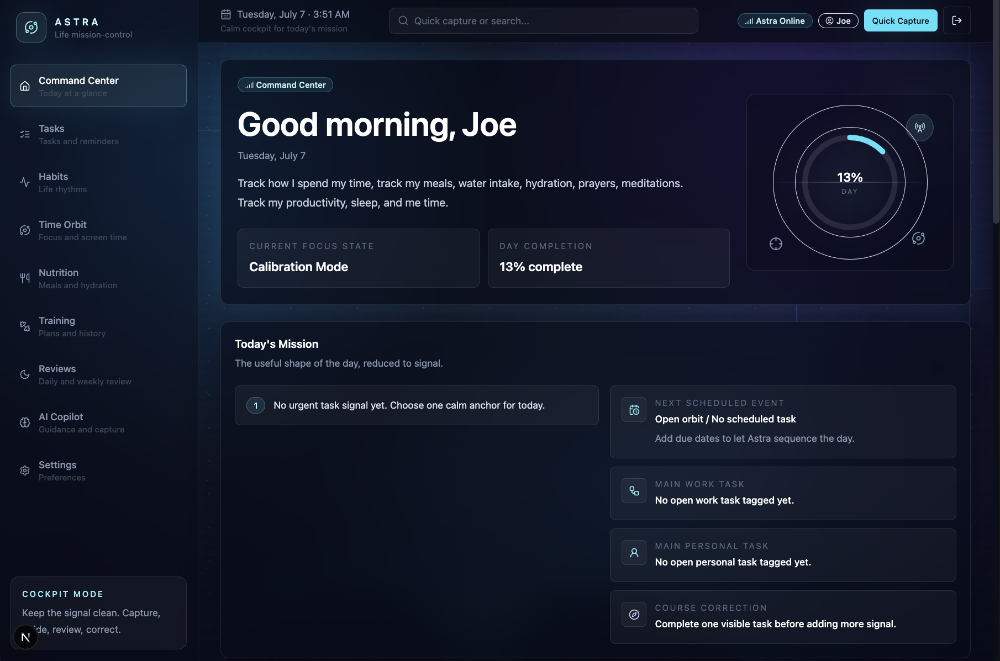
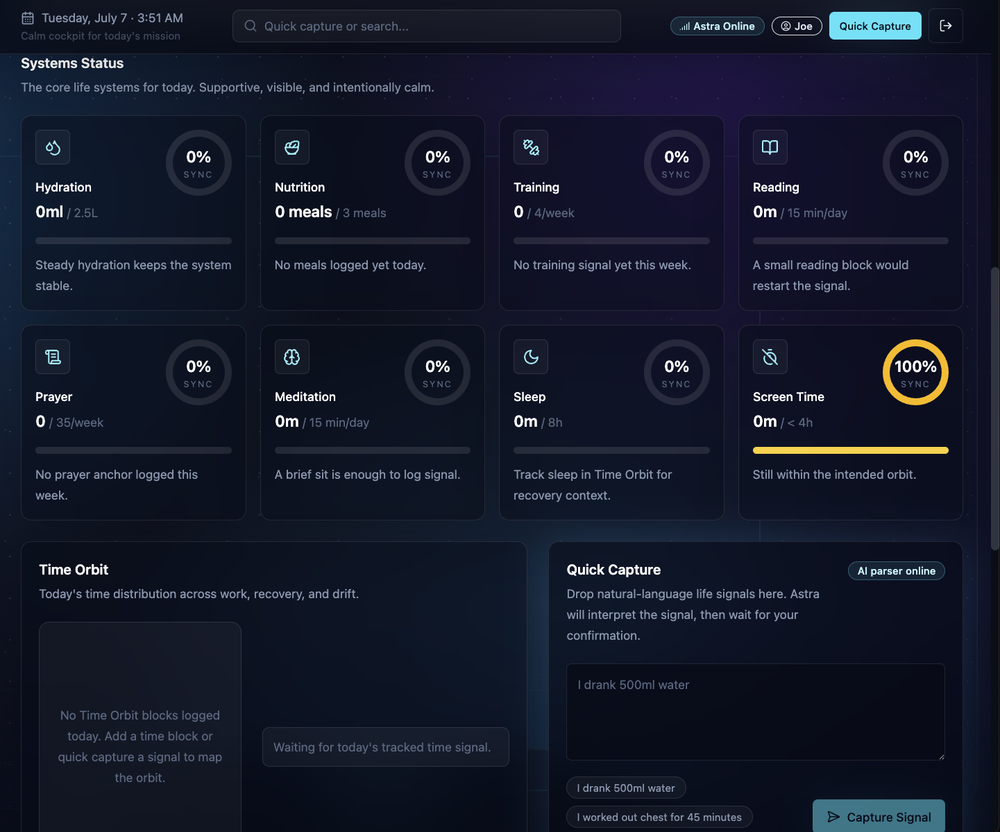
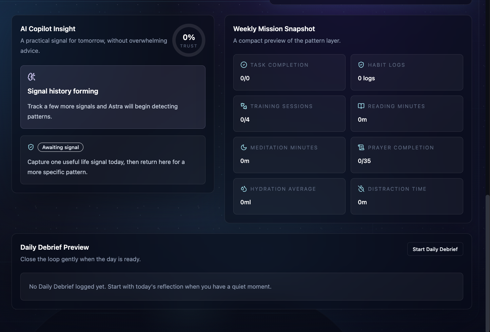
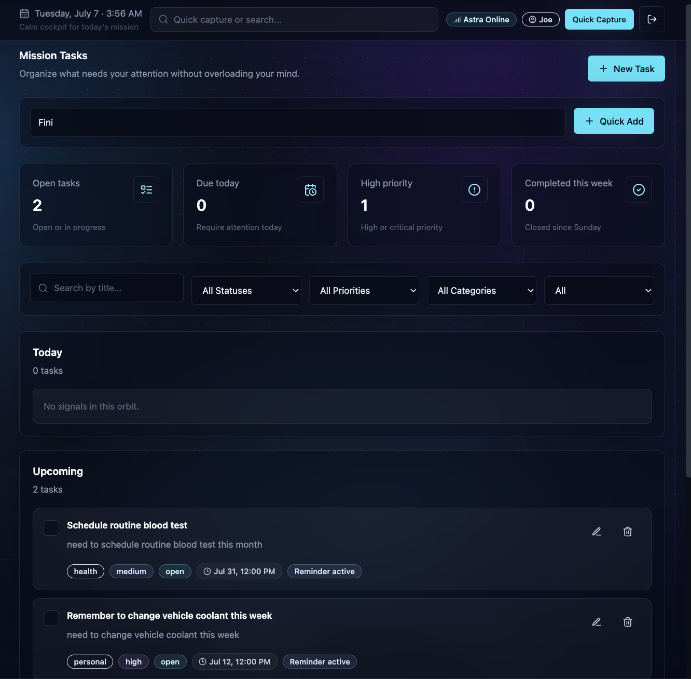
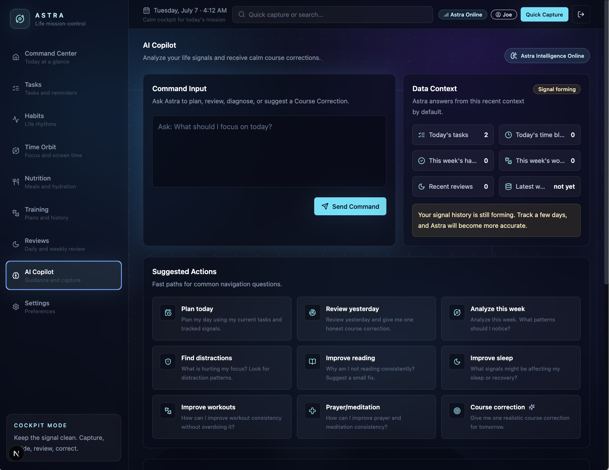
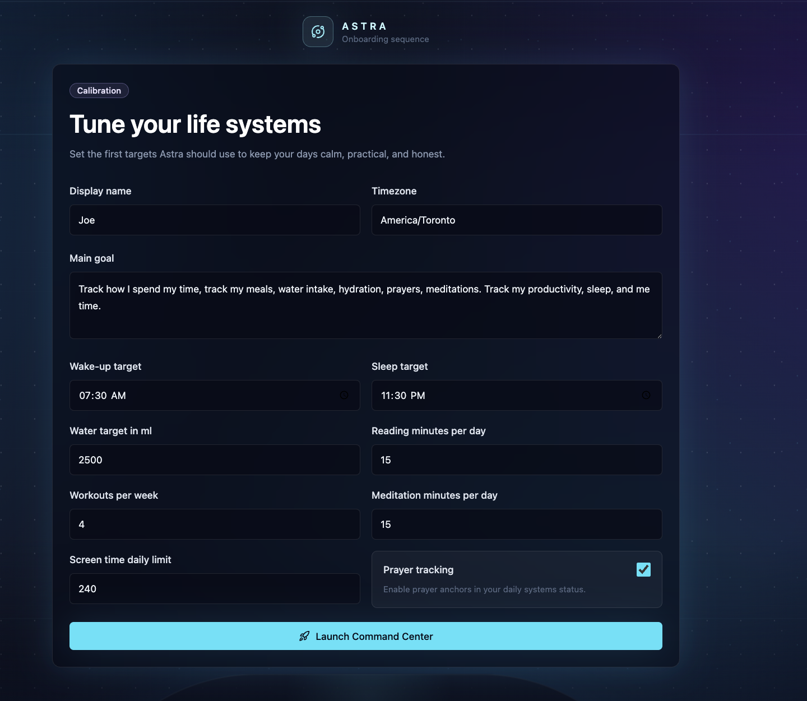

# Astra

Astra is a calm futuristic personal life operating system. It brings tasks, habits, time tracking, nutrition, training, reviews, AI insights, and settings into one mission-control cockpit. Data and auth run on **local SQLite by default**, with the original Supabase implementation preserved behind a provider abstraction (`lib/db/`) — see `DATA_LAYER.md`.

## Screenshots

A look at Astra v1.0.0.

### Command Center

The daily cockpit — greeting, day completion, focus state, and today's mission at a glance.



### Systems Status

Core life systems for the day: hydration, nutrition, training, reading, prayer, meditation, sleep, and screen time, with Time Orbit and Quick Capture.



### Weekly Mission Snapshot

AI Copilot Insight, a compact weekly pattern preview, and the Daily Debrief entry point.



### Tasks

Mission Tasks — quick add, status/priority/category filters, and Today / Upcoming grouping.



### AI Copilot

Ask Astra to plan, review, or suggest a course correction, grounded in your recent tracked context.



### Onboarding

Calibration step that sets the first targets Astra uses to keep days calm and honest.



## Tech Stack

- Next.js App Router
- TypeScript
- better-sqlite3 (default) / Supabase Auth + Postgres (preserved provider)
- Tailwind CSS
- shadcn-style UI primitives
- Framer Motion
- Recharts
- Zod
- React Hook Form
- OpenAI-compatible AI provider

## Environment Variables

Create `.env.local` and set:

```bash
NEXT_PUBLIC_APP_URL=http://localhost:3000
NEXT_PUBLIC_ASTRA_DB_PROVIDER=sqlite   # "sqlite" (default) or "supabase"
ASTRA_SQLITE_PATH=data/astra.db        # SQLite provider only
# Supabase provider only (required when the provider is "supabase"):
NEXT_PUBLIC_SUPABASE_URL=
NEXT_PUBLIC_SUPABASE_ANON_KEY=
SUPABASE_SERVICE_ROLE_KEY=
AI_PROVIDER=openai
OPENAI_API_KEY=
OPENAI_BASE_URL=https://api.openai.com/v1
OPENAI_MODEL=gpt-4o-mini
AI_REQUEST_TIMEOUT_MS=15000
```

Only `NEXT_PUBLIC_*` values are safe for browser code. Keep `SUPABASE_SERVICE_ROLE_KEY` and `OPENAI_API_KEY` server-only. Provider resolution and the full data-layer reference are in `DATA_LAYER.md`.

Use `.env.example` as the canonical environment template.

## Local SQLite Setup (default)

No external service required. `data/astra.db` is created and its schema applied on first request. Create a user (there is no email-based password reset in SQLite mode):

```bash
npm run db:user -- create you@example.com yourpassword
```

Then `npm run dev` and sign in. SQLite requires a persistent filesystem — it will not run on Vercel/serverless (use the Supabase provider there; see `VERCEL_DEPLOYMENT.md`).

## Supabase Setup (preserved provider)

Set `NEXT_PUBLIC_ASTRA_DB_PROVIDER=supabase` and the Supabase env vars, then apply the migrations in `supabase/migrations`:

```bash
supabase link --project-ref <project-ref>
supabase db push
```

The schema includes profiles, preferences, tasks, habits, time blocks, meals, water logs, workouts, prayer, meditation, reading, daily reviews, weekly reviews, AI insights, and quick captures. Row Level Security is enabled so authenticated users can only access their own rows.

Recent preference fields include AI tone/style and AI feature toggles:

- `ai_tone`
- `ai_recommendation_style`
- `daily_planning_enabled`
- `weekly_report_enabled`
- `course_correction_enabled`

Manual database types live in `lib/types/database.ts`.

See [SUPABASE_SETUP.md](./SUPABASE_SETUP.md) for production setup, RLS verification, Data API access, and auth callback configuration.

## AI Setup

AI provider access is isolated in `lib/ai/provider.ts`. Current AI routes:

- `/api/ai/quick-capture`
- `/api/ai/daily-review`
- `/api/ai/weekly-report`
- `/api/ai/copilot`
- `/api/ai/insights` — signal-correlation engine: deterministic stats from `lib/insights/` narrated by the AI

The browser never receives AI provider keys.

A public, static user guide describing every feature lives at `/guide` — linked from the landing page and the demo, and safe for anonymous visitors (no auth, no database, no AI calls).

## Development

```bash
npm install
npm run dev
```

## Build And QA

```bash
npm run lint
npm run typecheck
npm run build
npm run test
```

Authenticated Playwright E2E can be run with a seeded test user:

```bash
ASTRA_TEST_EMAIL=<test-email> ASTRA_TEST_PASSWORD=<test-password> npm run test:e2e
```

## Main Modules

- `/dashboard`: real daily command center using Supabase data
- `/tasks`: task planning and completion
- `/habits`: habits, prayer, meditation, and reading support
- `/time`: Time Orbit tracking
- `/meals`: nutrition and hydration
- `/workouts`: Training Log
- `/reviews`: Daily Debrief and Weekly Mission Report
- `/ai`: AI Copilot and saved insights
- `/settings`: profile, targets, AI behavior, appearance, and data controls

## Auth Flow

- `/login` supports email/password and magic links.
- `/signup` creates the Supabase user.
- `/onboarding` creates profile and preferences.
- `middleware.ts` protects app routes.
- Users without preferences are routed to onboarding.
- Auth email redirects use `NEXT_PUBLIC_APP_URL` and `/auth/callback`.

## Quick Capture

Dashboard Quick Capture:

1. Saves raw text to `quick_captures`.
2. Calls the server-side AI parser.
3. Displays interpreted output.
4. Lets the user confirm or cancel.
5. Inserts confirmed data into the correct table.
6. Refreshes the dashboard after confirmation.

## Known Limitations

- Appearance preferences are currently stored in `localStorage`.
- AI responses depend on available tracked data and configured provider keys.
- If the AI provider is missing, quota-limited, or slow, routes return safe user-facing errors.
- Screen time is approximated from `time_blocks.category = 'scrolling'`.
- Sleep is tracked through `time_blocks.category = 'sleep'`.
- Some integrations are represented as planned future work.

## Deployment

Astra is ready for Vercel deployment with Supabase as the backend.

- [VERCEL_DEPLOYMENT.md](./VERCEL_DEPLOYMENT.md): Vercel setup, env vars, Supabase redirects, deployment checks.
- [SUPABASE_SETUP.md](./SUPABASE_SETUP.md): Supabase project setup, migrations, RLS verification.
- [GO_LIVE_CHECKLIST.md](./GO_LIVE_CHECKLIST.md): final production QA checklist.
- [PRODUCTION_NOTES.md](./PRODUCTION_NOTES.md): launch notes and remaining limitations.

## Roadmap

- Native mobile app
- iPhone Screen Time integration
- Calendar integration
- Push notifications
- Wearable integration
- Deeper AI planning memory
- Supabase-backed appearance preferences

## Testing

- Unit/static checks: `npm run test`
- End-to-end testing: `npm run test:e2e`
